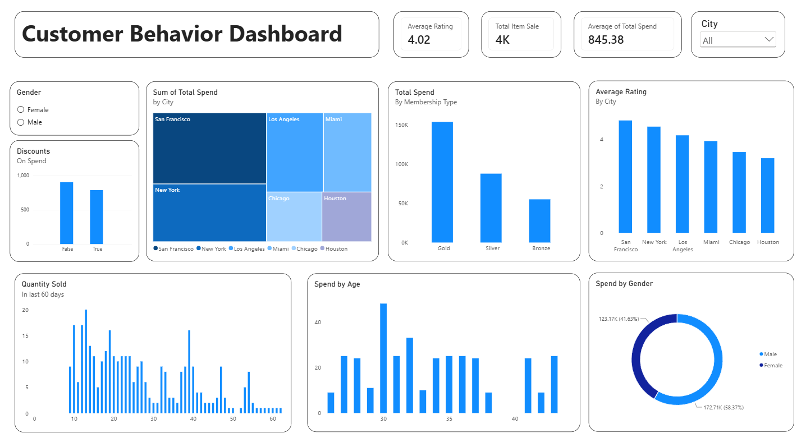

# Customer Behavior Analytics Dashboard

## Overview
An e-commerce business had spend data for 350+ customers across 6 cities — but no clear read on why some customers spent more than others, or which ones were at risk of leaving.

## The Problem
Leadership wanted to know: Are we rewarding the right customers with our membership tiers? Are our discounts actually working? And which cities deserve more marketing focus?

## Tools Used
Power BI, Excel

## Dataset
This Dataset contains 350+ customer insights their Age, Spend, Membership type, Total Spend, Items Purchased, Average Rating, Discount Applied, 
Days Since Last Purchase, and Satisfaction Level.

## Dashboard Preview

## Findings 
This single dashboard turned these columns into three business decisions: where to focus retention efforts, whether the tier system is paying off, and whether discounts are building loyalty or just eating margin.

## Key Insights
- Gold-tier members drive ~150K in spend — nearly 2x Silver, 3x Bronze
- San Francisco leads in both spend AND satisfaction rating
- Discount usage split nearly 50/50 — flagged for deeper analysis
- Female customers account for 58% of total spend
- Overall average customer rating: 4.02/5
